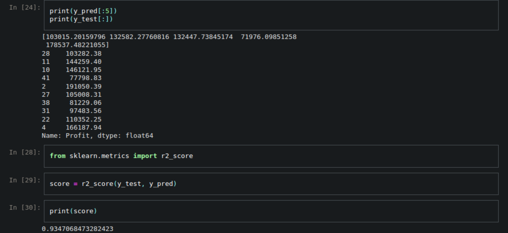

# Startup_Success_Predictor

# **Startup Profit Prediction Using Multiple Linear Regression**


This project demonstrates the use of **Multiple Linear Regression** to predict the profits of startups based on investment in R&D, Administration, and Marketing. The dataset (`50_Startups.csv`) includes 50 records of startups with features such as `R&D Spend`, `Administration`, `Marketing Spend`, `State`, and `Profit`. The analysis preprocesses the dataset (including encoding categorical data), splits it into training and testing sets, and builds a predictive model using Python libraries like **pandas**, **NumPy**, and **scikit-learn**. Insights on model performance are obtained using evaluation metrics such as R-squared.

---

## **Description of the Dataset**

The 50_Startups.csv dataset contains information about 50 startups, with the following attributes:

*R&D Spend*: Investment in research and development. ($) //
*Administration*: Investment in administrative operations. ($) //
*Marketing Spend*: Budget allocated for marketing campaigns. ($) //
*State*: The state where the startup operates. (New York, California, or Florida) //
*Profit*: The target variable, representing the net profit of the startup. ($) //

---

### **Key Insights** :

Profit and R&D Spend: Higher R&D investments often correlate with higher profits, suggesting it is a crucial factor.
State Influence: The dataset includes three categorical states. Encoding this variable helps explore its influence on profit.
Balanced Features: All numeric columns represent monetary values, making preprocessing straightforward without scaling.

---

## **Key Steps**
1. **Data Preparation**: Cleaned and encoded categorical data (`State`), then split into independent variables (`X`) and the dependent variable (`Profit`).  
2. **Model Building**: Trained a Multiple Linear Regression model using `LinearRegression` from **scikit-learn**.  
3. **Prediction and Evaluation**: Predicted startup profits on test data and assessed performance metrics.  

Run the notebook to reproduce the workflow or adapt the model for similar regression problems.

## **Metrics** 


---

# **Code** :

```python
import pandas as pd
from nbformat import read

# Paths to the uploaded files
notebook_path = '/mnt/data/Multiple_Linear_Regression.ipynb'
dataset_path = '/mnt/data/50_Startups.csv'

# Load and analyze the Jupyter notebook content
with open(notebook_path, 'r', encoding='utf-8') as f:
    notebook = read(f, as_version=4)

# Load the dataset to inspect its structure
dataset = pd.read_csv(dataset_path)

# Extract the notebook structure
code_cells = [cell['source'] for cell in notebook['cells'] if cell['cell_type'] == 'code']
markdown_cells = [cell['source'] for cell in notebook['cells'] if cell['cell_type'] == 'markdown']

# Get dataset summary and notebook insights
dataset_info = {
    "columns": dataset.columns.tolist(),
    "shape": dataset.shape,
    "head": dataset.head().to_dict()
}

notebook_info = {
    "total_cells": len(notebook['cells']),
    "code_cells_count": len(code_cells),
    "markdown_cells_count": len(markdown_cells),
    "example_code_snippet": code_cells[:2],  # First two code cells for reference
    "example_markdown": markdown_cells[:2]  # First two markdown cells for reference
}

dataset_info, notebook_info
```

---

[ Linkedin | ](https://www.linkedin.com/in/rachuri-vijaykumar/)  // [ Github | ](https://github.com/vijaykumarr1452)  // [ EMAIL ](mailto:vijaykumarit45@gmail.com)


